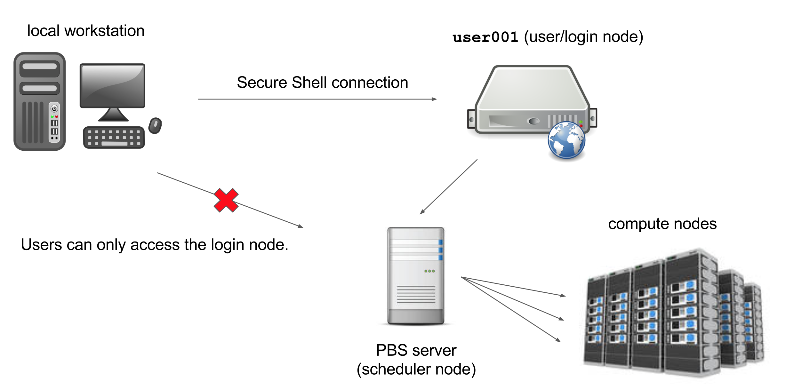

> ## Learning objectives {.objectives}
> * Learn how to log in to the Palmetto cluster.
> * Learn the basic structure of the Palmetto cluster.

In this workshop,
we will use a command-line interface to interact with
the Palmetto cluster, which runs the Linux operating system
specifically, [Scientific Linux](https://www.scientificlinux.org/).
However, note that these commands can be used on
any *Unix-based* operating system,
including Mac OS X.

To be able to run commands on the Palmetto from your own machine,
you will first need to be able to log in to the Palmetto.
This is known as a *remote login*.
If you run Mac OS X or any other Unix-based operating
system on your machine,
you can log in remotely by opening a terminal
and using the `ssh` command:

~~~{.bash}
$ ssh username@user.palmetto.clemson.edu
~~~

If you run Windows,
you will use the SSH Secure Shell to log in.
Click on  `File > Quick Connect`,
and use the following parameters (whichever required):

* Host name: `user.palmetto.clemson.edu`  
* User name: Clemson username   
* Port number: 22  
* Authentication method: none specified

When logged in,
you are presented with a welcome message
and the following "prompt":

~~~{.bash}
[username@user001 ~]$ 
~~~

The prompt in a bash shell usually
consists of a dollar (`$`) sign,
and shows that the shell is waiting for input.
The prompt may also contain other information:
this prompt tells you your username and which node
you are connected to -
`user001` is the "login" node.
It also tells you your current directory,
i.e., `~`, which, as you will learn shortly,
is short for your *home* directory.
We will mostly refer to the prompt as just `$`, i.e.,

~~~{.bash}
$ 
~~~

## Basic structure of the cluster

The Palmetto cluster has several "compute" nodes
that can perform fast calculations on large amounts of data.
It also has a few so-called "service" nodes,
that are *not* meant for this purpose.
Instead, they are meant to help users perform other actions
such as transfering code and data to and from the cluster.

The most important of these "service" nodes is
the login node `user001`.
The login node runs a "server" program
that listens for remote logins.
On our own machines, we run a "client" program
(Secure Shell or `ssh`) that can talk to this server.
Our client program passes our login credentials to this server,
and if we are allowed to log in,
the server runs a shell for us on the computer
it is running on (`user0001`).
Any commands that we enter into this shell
are executed not by our own machines,
but by `user0001`.

Another important service node on the Palmetto cluster
is the *scheduler* node.
The scheduler decides which
users can run their computations on the cluster and when---but
more on that later.
